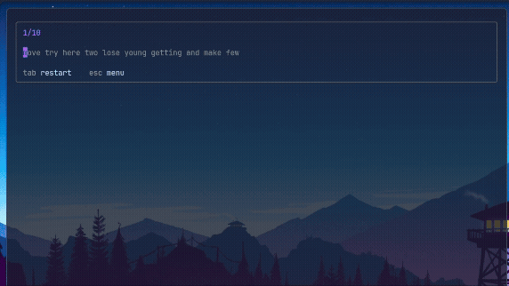

# sotype

A full-screen terminal typing test in the style of [monkeytype](https://monkeytype.com):
live per-character coloring, a smooth caret that glides between characters at sub-cell
resolution, timed and word-count modes, themes, and run history while all in your terminal.

## Screenshots



## Running from source

Requires the [.NET 10 SDK](https://dotnet.microsoft.com/).

```sh
dotnet run --project src/Sotype.Console
```

`Tab` restarts a test, `Esc` returns to the menu (or quits from the results screen),
`Enter`/`m` on the results screen goes back to the menu.

## Building

```sh
dotnet build
dotnet test
```

## Architecture

- `Sotype.Domain`: the domain layer, totally independent of any runtime logic
- `Sotype.Infrastructure`: implementation of domain level interfaces for things like word lists
- `Sotype.Console`: The UI layer, runs as a console app

## Packaging

Pushing a `v*` tag (e.g. `git tag v0.1.0 && git push origin v0.1.0`) runs the release
workflow, which builds an Arch Linux package from [`packaging/PKGBUILD`](packaging/PKGBUILD)
a Debian package, an RPM package, and a Windows zip, and attaches them to a GitHub release.

On Arch Linux:

```sh
sudo pacman -U sotype-<version>-1-x86_64.pkg.tar.zst
```

On Debian/Ubuntu (self-contained, so no .NET install is required):

```sh
sudo apt install ./sotype_<version>-1_amd64.deb
```

On Fedora/RHEL/openSUSE (also self-contained):

```sh
sudo dnf install ./sotype-<version>-1.x86_64.rpm
```

On Windows, extract `sotype-<version>-windows-x64.zip` and run `sotype.exe`. It is
self-contained, so no .NET install is required.

## License

[MIT](LICENSE)
